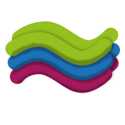

#  Real3DFFF

Traditional vs Curved-Layer Fused Filament Fabrication (CLFFF) using Real3DFFF

https://user-images.githubusercontent.com/24637325/230965579-060c6ff2-75d5-4293-90fa-5e9db6e54b03.mp4

# Features

*  Generate curved tool paths for FFF-Printers including normal vectors for 5-axis printing
*  Generate Preform geometries
*  Extract geometries for support only generation
*  Import/Export of G-Code, STL, STEP, IGES

# Install
Real3DFFF requires a big set of dependencies, some of them being a bit dated.
To make things easier, a complete python environment is provided in addition to the code to get you started in no time.

1. Download the package from the GitHub release section.
2. Extract the files. 
3. Run `main.py` using the provided python interpreter in the root folder of the extracted files.

# Usage

```python
import os

from data_io.loaders import load_step
from gcode.gcode_visualizer.virtual_reprap import VirtualRepRap
from gcode.real_3d.generate_curved_layer import generate_curved_layer_christl
from globals import ANGULAR_DEFLECTION

if __name__ == "__main__":
    """
    Generate curved layer Fused Filament Fabrication paths using the algorithm according to Christl
    """
    path_geo = "test_geometry/wave_rounded/wave_round.stp"
    # path to preform G-Code
    path_gcode = "test_geometry/wave_rounded/wave_round_preform_IdeaMaker.gcode"
    # Path to output file that will be created with the final curved layer gcode inside
    path_out_file = "test_geometry/wave_rounded/wave_round_curved.gcode"
    # supply preform geometry if you want to use the local layer index -> This feature does not work yet use None
    path_preform = None

    if os.path.exists(path_out_file):
        os.remove(path_out_file)

    part_shape = load_step(path_geo)
    preform_shape = load_step(path_preform)
    vreprap = VirtualRepRap()
    preform_gcode = vreprap.readin_gcode(path_gcode, 0.2, 0.4)

    curved_layer_gcode = generate_curved_layer_christl(part_shape, preform_gcode, path_out_file,
                                                       preform_shape=preform_shape,
                                                       max_lin_deflection=0.5,
                                                       ang_deflection=ANGULAR_DEFLECTION,
                                                       min_segment_length=0.2,
                                                       max_extrusion_err=0.5,
                                                       lifted_travel_dist=2,
                                                       low_trav_clearance=0.5,
                                                       high_trav_clearance=1,
                                                       max_len_direct_trav=2,
                                                       compute_normals=False
                                                       )
```

# Examples


Extrusion rate and computed normal vector.

# Notes
Author: Wolfgang Christl 

All code licensed under GNU LESSER GENERAL PUBLIC LICENSE V3
